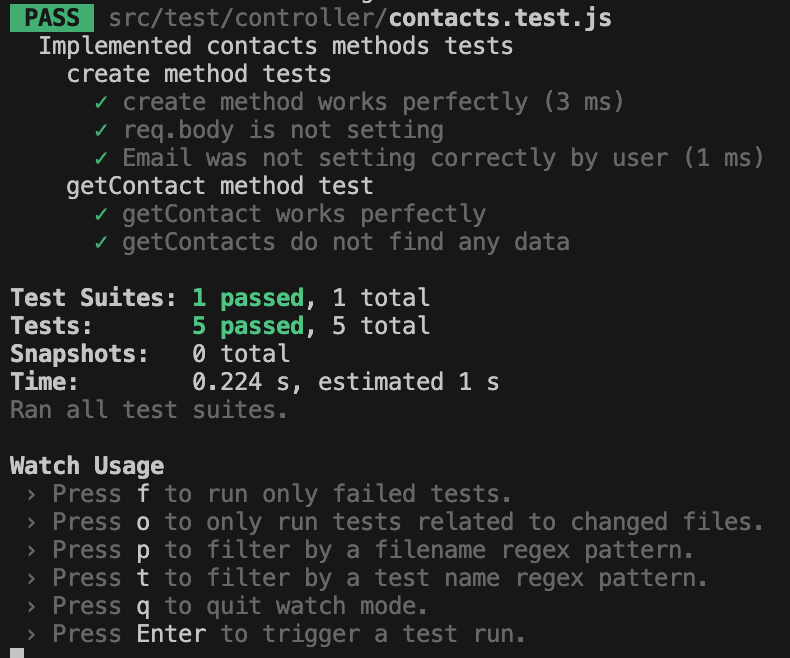

# pruebaTecnicaBO
***

## Introduction 
This is technical test developed to demonstrate my knowledge of Javascript, Express, Node.js and Jest. Basically, The challenge consists of developing a CRUD application that interacts with Hubspot API. The architecture pattern used in the project was MVC with some elements inspired by CLEAN architecture for better structure and SoC.

## Description
To run this project, first download or clone the repository. Then, navigate to the project directory and run the following commands:

```bash
chmod +x script.sh
./script.sh
```

This script will automate the installation process, including dependency setup. Once you have already installed, you can execute with the next command:

```bash
npm run start
```

This command will run the principal file to run all application. If you want to test every function, you must write the next urls in postman:

1. http://localhost:4000/technicalTest/createcontact (you must add a body in the request and choose POST method)
2. http://localhost:4000/technicalTest/getallcontacts (you must choose GET method)
3. http://localhost:4000/technicalTest/contact/:id (you must choose GET method and write the id in ":id")
4. http://localhost:4000/technicalTest/getcontactwithemail/:email (you must choose GET method and write the email in ":email")
5. http://localhost:4000/technicalTest/updatecontact/:id (you must choose PATCH method and add a body with the data that you want to update)
6. http://localhost:4000/technicalTest/deletecontact/:id (you must choose DELETE method)

## TEST

To run tests in this project, you have to run the next command:

```bash
npm run test
```

You should see a message in your terminal like next one:


This indicates that all test are correctly implemented and passing. However, if you plan to edit tests and you do not want to run this command manually each time, you can run the next command:

```bash
npm run test:watch
```



With this command, it will "watch" every change that you make in the test. Every change you saved, the tests will automatically re-run.
